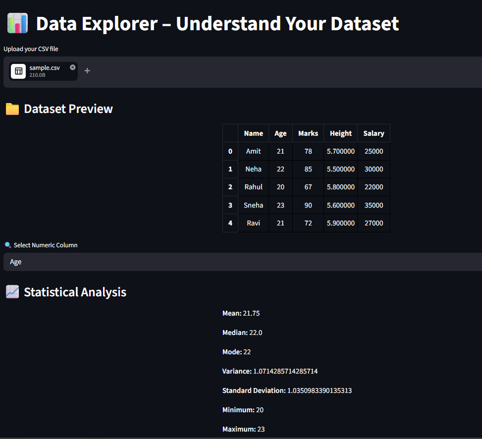
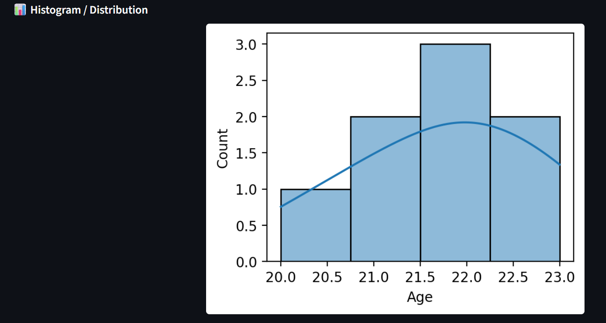

# 📊 Data Explorer App

This is a Streamlit app to explore datasets using statistics.

## 🚀 Features
- Upload CSV dataset
- Select numeric column
- Calculate Mean, Median, Mode
- Variance and Standard Deviation
- Min and Max values
- Histogram visualization
- Data insights

## 📸 Screenshots

### 🔹 Dataset & Statistics

### 🔹 Histogram Visualization

## ▶️ How to Run

pip install -r requirements.txt  
python -m streamlit run app.py